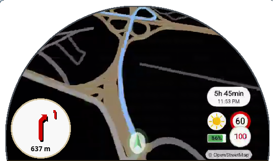

# DashMap-Releases

  

Public download point for **DashMap** releases. This repo contains **only
binaries** (see below): no source code, no build tooling. The app's own
in-app updater tracks this repo.

> DashMap itself is a closed-source, independent project. **Not affiliated
> with, endorsed by, or supported by Royal Enfield.** "Royal Enfield",
> "Himalayan" and "Tripper" are trademarks of their owners.

## What DashMap is

Turn-by-turn motorcycle navigation for the Royal Enfield Himalayan 450,
drawn on the bike's round Tripper TFT dash while the phone screen stays
off. Instead of mirroring the display (which keeps the screen lit and
cooks the phone), DashMap renders the map off-screen, hardware-encodes it
to H.264 and streams it over the bike's Wi-Fi, so the phone stays cool and
sips battery for the whole ride.

  

- **Navigation**: share a destination from Google Maps, preview the road
  route with distance and arrival time, send it to the dash. Turn-by-turn
  with automatic off-route rerouting: online routing first, offline
  package when there is no signal. Online place search, planned
  multi-stop trips and imported GPX tracks included.
- **Offline maps**: full packages (Valhalla routing tiles and Nearby
  streets database) downloadable straight from the app, no computer
  needed. The visual map background streams online; Minimalist mode rides
  on the streets database with no tiles at all.
- **Automatic dash connection**: the app discovers any `RE_*` dash,
  remembers yours and reconnects on its own, with an optional
  auto-connect that links when the bike is near.
- **Personalization**: day/night dash themes (fixed or automatic by clock
  or sunset/sunrise), full PT-BR and English localization, widget
  toggles, colors, sizes and arrival behavior.
- **Minimalist map**: a stripped night-friendly view with just the route,
  nearby streets and ETA, no map tiles. Two quick DOWN clicks toggle it
  from the handlebar.
- **Road awareness**: posted speed limits with a speed-limit sign widget,
  speed-camera alerts with an early warning, fuel-pump markers on the map
  and a weather forecast glyph.
- **Media and calls**: a dash media menu (restart, next track,
  play/pause) with track info, and incoming calls shown on the dash with
  answer/reject from the joystick, audio through the helmet.
- **Voice guidance**: off, chime-before-turns, or full spoken turn-by-turn,
  on-device, in PT-BR and English.
- **Rides**: every finished navigation saved automatically with distance,
  duration, speeds and a track map.
- **Private by design**: no account, no server. Everything lives on the
  device.

Requires a 64-bit ARM Android phone on Android 10+ and a Himalayan 450 with
the Tripper dash.

## Using the dash joystick

The handlebar joystick has two modes. It starts in HOME mode every time
the bike turns on; ENTER enters Navigation/Media mode, the HOME button
goes back.

HOME mode:

- **UP**: asks on the dash whether to cancel the navigation; confirm there
  to stop.
- **RIGHT / LEFT**: zoom the map in / out.
- **DOWN**: nothing.
- **UP + UP**: opens the saved-routes list on the dash (RIGHT confirms and
  starts navigating, LEFT goes back).
- **DOWN + DOWN**: switches the map between full and minimalist.
- **LEFT + LEFT**: opens the app's media menu on the dash.

Inside the media menu: LEFT restarts the track, RIGHT plays the next one,
ENTER toggles play/pause, UP returns to the map.

Calls (Navigation/Media mode): when the call notice appears on the dash,
**UP** answers the ringing call, **DOWN** declines it, and during a call
**DOWN** ends it.

## The binaries

Every release carries up to three files:

- **`DashMap.apk`**: the app itself. Sideload it (allow "install unknown
  apps" when asked). Signed with the same key every time, so updates
  install in place and keep your data. Android may show an "unverified app"
  warning: expected for a self-managed community key.
- **`DashMapOfflineMaps-linux`**: the offline-maps desktop tool for
  Linux. Prepares routing + streets packages on a computer and sends them
  to the phone over USB or Wi-Fi. Optional: the app also downloads
  ready-made packages by itself.
- **`DashMapOfflineMaps-windows.exe`**: the same desktop tool for Windows.

## Credits

Same licenses and attributions the app carries under Settings → Credits,
license first:

- **NorthStar**: © 2026 Aditya Dasika · Apache License 2.0
- **OpenStreetMap contributors**: © OpenStreetMap contributors · ODbL, attribution required
- **OpenFreeMap**: map tiles · OSM data © contributors (ODbL)
- **MapLibre**: map rendering · BSD-2-Clause
- **Valhalla**: routing engine · MIT
- **OSRM**: online routing service · shared demo server, fair use
- **Overpass API**: live map queries · public instance, fair use
- **Nominatim**: place search · OSMF usage policy
- **Open-Meteo**: weather data · free API, see its terms (data CC-BY 4.0)
- **Geofabrik**: data extracts · OSM data (ODbL)
- **better-dash (Apache-2.0)**: dash protocol reference; implementation independent

The routing tiles and street databases in these releases derive from
OpenStreetMap data, so the ODbL credit above travels with them. See
https://osm.org/copyright.
